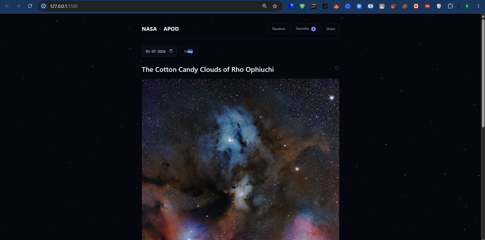

# staring at space, one day at a time.

a tiny website that pulls nasa's astronomy picture of the day and lets you scroll through decades of space photography. built with zero frameworks—just raw html, css, and js.

## screenshot




## what's inside:

- browse any date back to june 1995 (the very first apod)
- random button for when you just want to discover something
- click any image to see it full screen
- save your favorites to a slide-out panel (they stay even if you refresh)
- smooth loading skeletons and a little starfield background

## deploying to vercel

This repo is set up as a zero-config Vercel project: static files at the root, and `api/apod.js` becomes a serverless function automatically — no `vercel.json` needed.

1. push this repo to GitHub (without `.env` — it's gitignored, so it won't go up).
2. import the repo at vercel.com → New Project.
3. in the project's **Settings → Environment Variables**, add:
   - `NASA_API_KEY` = your key from api.nasa.gov
4. deploy. Vercel serves `index.html`/`style.css`/`script.js` as static assets and runs `api/apod.js` as a serverless function at `/api/apod`.

`server.js` is only used for local development (`npm start`) and is not used by Vercel — Vercel runs `api/apod.js` instead.

## try it out (local dev):

1. grab a free api key from api.nasa.gov (if you had an old key exposed publicly, generate a new one — old keys should be treated as compromised)

2. copy `.env.example` to `.env` and paste your key in:

```bash
cp .env.example .env
```

3. install dependencies and start the server:

```bash
npm install
npm start
```

4. open http://localhost:8000

**Why the extra step?** The API key now lives only in `.env` on the server and is never sent to the browser. The frontend calls a local `/api/apod` route, which the server uses to fetch from NASA on your behalf. `.env` is gitignored, so the key won't end up in your repo or git history.

## why i built it:

wanted to learn how to consume apis in vanilla js without reaching for react. turns out you can make something that feels really smooth with just fetch, localStorage, and a few css animations.